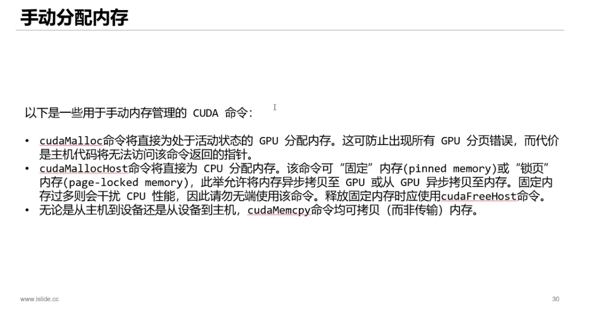
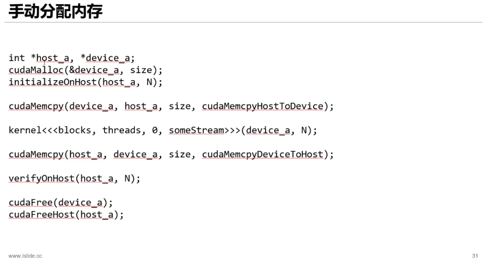

<h5>在CUDA编程中，使用cudaMallocHost函数分配的内存是锁页内存，这意味着该内存页不会被交换到磁盘上，从而提高了访问速度。此外，锁页内存还可以直接与GPU内存进行数据传输，而不需要通过PCIe总线，从而进一步提高了数据传输速度。

在 CUDA 编程中，GPU 可以直接使用 cudaMallocHost 分配的锁页内存，是因为这些内存页已经被固定在物理内存中，并且可以直接映射到 GPU 的地址空间中。因此，在 Kernel 函数中可以直接访问这些内存页，而不需要进行额外的数据传输或者拷贝操作。

而 cudaMalloc 申请的内存仅可 gpu 访问，cpu 访问只能通过 cudaMemcpy 拷贝到 cudaMallocHost 申请的内存上之后进行访问</h5>
</img>
</img>
