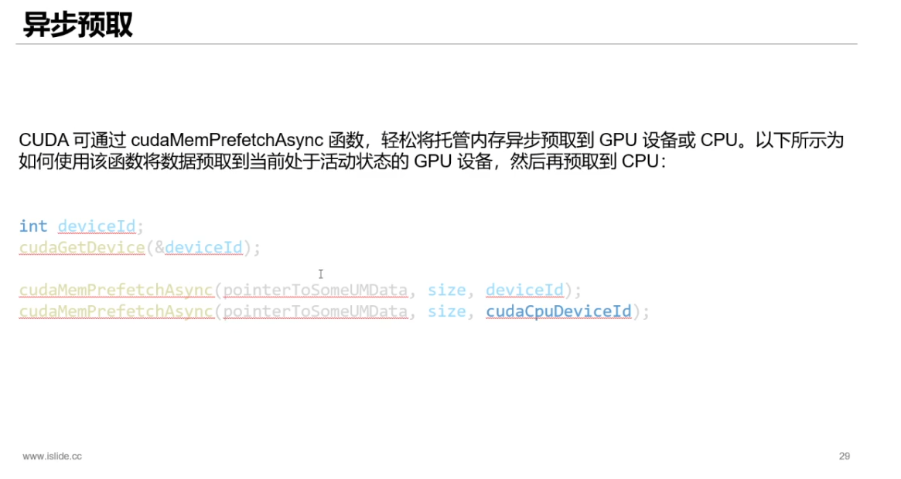

<h4>统一内存寻址（Unified Memory） 是一种内存管理模型，允许CPU和GPU通过同一虚拟地址空间访问物理内存，开发者无需手动管理数据在主机（CPU）与设备（GPU）之间的传输。其本质是抽象硬件差异，实现以下目标：</h4>
<h5>
编程简化：消除显式的cudaMemcpy等数据传输代码。 
内存共享：CPU与GPU可直接读写同一数据指针（如cudaMallocManaged分配的指针）。 
自动迁移：数据按需在CPU内存（DDR）与GPU显存（HBM）之间迁移，由驱动或硬件触发。</h5>

---

<h5>关键技术： 
地址空间统一：
CPU与GPU的虚拟地址映射到同一物理地址空间（如NVIDIA UVA技术），通过PCIe BAR（基地址寄存器）实现地址转换。 
按需页面迁移：
当GPU访问未驻留显存的页面时触发Page Fault，驱动将数据从CPU内存迁移至显存（反之亦然）。 
预取优化：
开发者可通过cudaMemPrefetchAsync主动预取数据到目标设备，避免运行时迁移开销。 
缓存一致性：
硬件方案（如AMD hUMA）通过MESI协议维护缓存一致性，软件方案（如早期CUDA）需手动同步。</h5>

---

</img>
</img>

<h4>初始UM统一将数据地址映射到cpu内存 
第一次如果是cpu访问不会页错误进行数据迁移 
gpu访问则会缺页中断进行数据迁移 
后续操作中：如果当前数据在gpu内存，则cpu访问会页中断 进行数据迁移； 
同样，如果当前在cpu内存，gpu访问数据也会页中断，进行数据迁移
</h4>
参考：<a href ="https://www.cnblogs.com/smartljy/p/18850429">GPU与CPU统一内存寻址：技术原理与实现价值</a>
