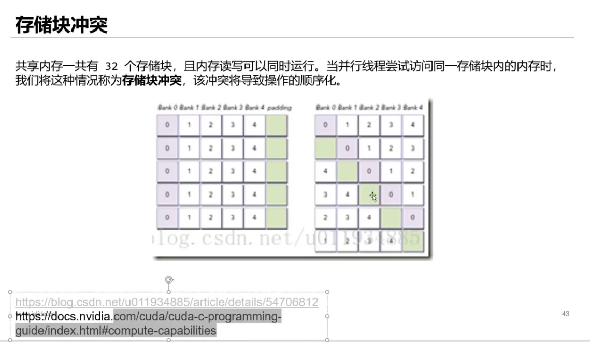
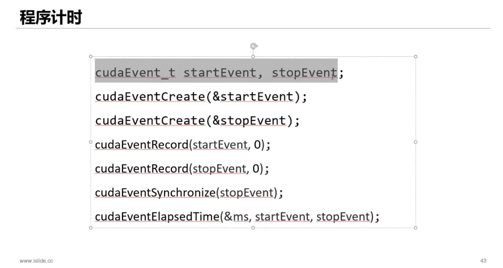

#### 共享内存，快，在 SM 内,区别于 global memroy

 </img>

<a href="https://developer.nvidia.com/blog/efficient-matrix-transpose-cuda-cc/">CUDA C/C++中一种高效的矩阵转置算法</a>

<a href="https://zhuanlan.zhihu.com/p/434159460">CUDA 矩阵转置优化（看图）</a>

补充工具：
</img>
